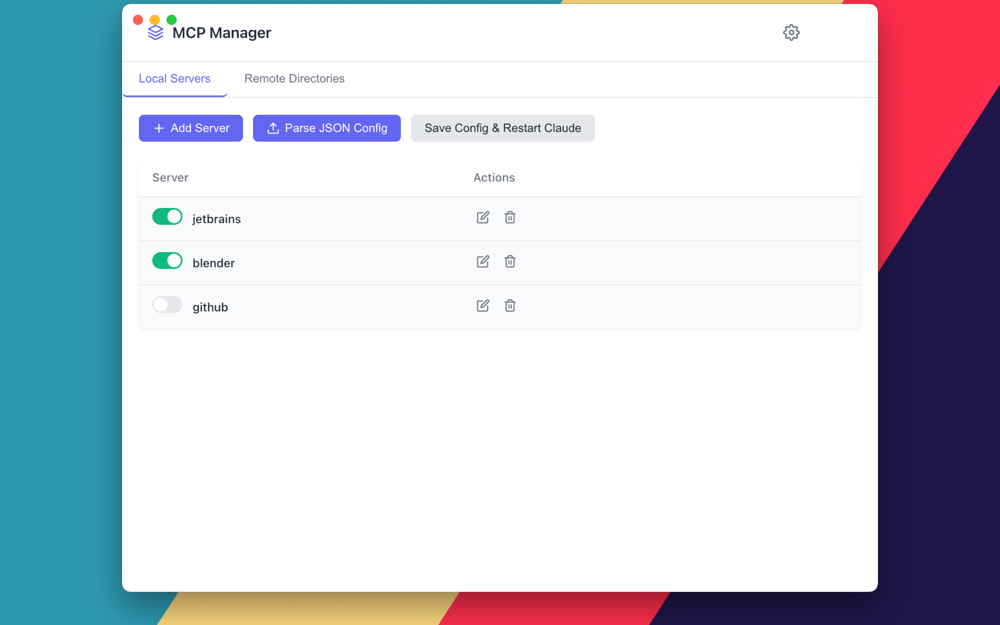

# MCP Manager

A macOS Electron application for managing Claude MCP server configurations with a user-friendly GUI.

## Platform Support

MCP Manager is currently **macOS-only** due to:

1. macOS-specific Claude app location (`~/Library/Application Support/Claude/`)
2. macOS-specific process management commands (`pgrep`, `kill`, `open -a`)
3. macOS-specific UI elements (menu bar integration)
4. Clipboard handling designed for macOS permissions

To make it multiplatform would require:
- Adding Windows/Linux config paths for Claude
- Implementing platform-specific process management
- Adapting the tray icon behavior for different platforms
- Modifying clipboard permission handling

## Features

- **MCP Server Management**: Add, edit, delete, and toggle MCP servers for Claude
- **Toggle Servers On/Off**: Enable or disable servers without losing their configurations
- **Automatic Config Generation**: Automatically generate Claude config with only enabled servers
- **Claude Integration**: Restart Claude with only selected servers
- **System Tray Integration**: Quick access to enable/disable servers from the system tray without reopening menus
- **JSON Import**: Easily import MCP server configurations from JSON directly from the main screen
- **Server Persistence**: Disabled servers are preserved when the app is restarted
- **Config Backup**: Automatically create backups before overwriting Claude's configuration

## Screenshots




## System Requirements

- macOS 10.14 or later
- Node.js 14 or later

## Installation

### From Source

```bash
# Clone the repository
git clone https://github.com/danmartuszewski/mcp-manager.git
cd mcp-manager

# Install dependencies
npm install

# Run the app in development mode
npm run dev

# Build the app for production
npm run build
```

## Usage

### Managing Servers

1. **Add a Server**: Click the "Add Server" button and fill in the details:
   - Name (unique identifier used in the Claude config)
   - Definition (JSON with command and args)

2. **Parse JSON Config**: Import servers directly from a JSON configuration:
   - Click the "Parse JSON Config" button
   - Paste your JSON configuration
   - The system will automatically extract all server definitions

3. **Edit a Server**: Click the edit icon next to any server to modify its details

4. **Toggle Servers**: Use the toggle switches to enable or disable servers
   - Disabled servers are preserved when the app is restarted

5. **Delete a Server**: Click the delete icon to remove a server from your list

### Applying Changes to Claude

1. **Save Config & Restart Claude**: Saves the configuration and restarts Claude with only the enabled servers

### Remote Directories

1. Navigate to the "Remote Directories" tab
2. Access external resources like MCP.so or the GitHub Awesome MCP Servers repository

### Using the System Tray

- Click the MCP Manager icon in your macOS menu bar
- Toggle servers on/off directly from the menu without it closing
- Restart Claude with only enabled servers

## Settings

- **Claude Config Path**: Specify where Claude's configuration file is located
- **Create Backups**: Automatically create backups before overwriting Claude's config

## Development

### Project Structure

```
mcp-manager/
├── main/                 # Main process (Electron)
├── renderer/             # Frontend code (HTML/CSS/JS)
├── tray/                 # System tray logic
├── resources/            # Icons, assets
├── test/                 # Tests
│   ├── unit/             # Unit tests
│   └── e2e/              # End-to-end tests
├── package.json          # Dependencies and scripts
```

### Building

```bash
# Build for macOS
npm run build
```

### Testing

The project includes comprehensive tests for both the main and renderer processes:

```bash
# Run all tests
npm test

# Run unit tests only
npm run test:unit

# Run end-to-end tests
npm run test:e2e
```

#### Test Structure
- **Unit Tests**: Test individual components and functions
  - Config generation
  - IPC handlers
  - UI components
  - Tray functionality
- **E2E Tests**: Test the application as a whole
  - Window creation
  - UI element presence
  - Modal interactions

## Future Development Goals

- **Cross-platform support**: Adapt the application to work on Windows and Linux
- **Automated MCP server discovery**: Easily find and add new MCP servers
- **Server categorization**: Organize servers by type or function

## Contributing

Contributions are welcome! Please feel free to submit a Pull Request.

## Acknowledgements

- Claude by Anthropic
- Electron framework
- The Claude MCP community 